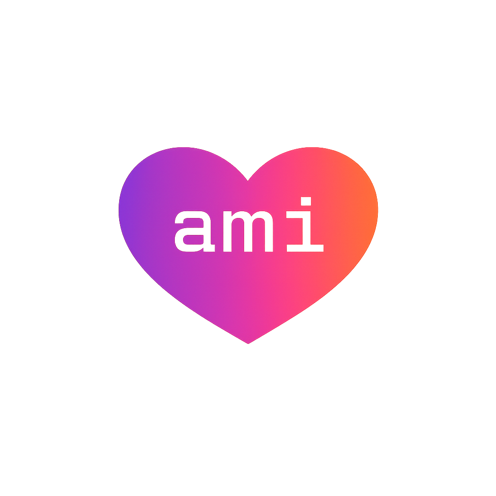

# Amiga IA - Universal Declarative Skills & Agents

<p align="center">
  
</p>

> 🎶 Repo name inspo: [Amiga Mia - Los Prisioneros](https://www.youtube.com/watch?v=qPHaLk4-_Ew)

> 🤖 Product website: [amiga-ia.ana-catalina.com/](https://amiga-ia.ana-catalina.com/)

---

[](#)
[](#)
[](https://www.npmjs.com/package/@anacatavc/amiga-ia)

---

[English](#english) | [Español](#español)

---

<a name="english"></a>
## English

### 1. Project Description
**Amiga IA** is a centralized repository for storing *declarative skills*, *declarative agents*, and a *universal adapter* that are 100% cross-compatible with **Antigravity (Gemini)** and **Claude Code**. It provides a single source of truth for modern, modular AI capabilities formatted using the **Agent Skills (Markdown + Lazy Loading)** standard.

### 2. Repository Structure
```text
amiga-ia/
├── package.json             # NPM Package definition
├── agent/                   # Boilerplate Agent entrypoint (agent.js)
├── adapters/                # Universal adapter (universal_adapter.js)
├── agents/                  # Declarative Markdown agents
│   └── *.md                 # Individual agent definitions
├── docs/                    # Persistent agent memory and architecture docs
├── skills/                  # Declarative Markdown skills
│   └── */SKILL.md           # Individual skill definitions in directories
└── hooks.json               # Claude Code native hooks configuration
```

### 3. Declarative Format

#### Skills
All skills are defined as declarative directories containing a `SKILL.md` file. The adapter scans these directories, extracts the YAML frontmatter, and provides the LLM with an XML index (`<available_skills>`). When the agent decides to use a skill, it reads the Markdown file natively to understand the instructions.
```yaml
---
name: ami-quick-reviewer
description: Reviews the code for logic errors.
---
1. Read the files.
2. Run tests.
```

#### Agents
Agents are defined in `.md` files containing the persona and instructions.
```markdown
# ami-commit-assistant
You are an agent designed to create commits.
Use the `ami-quick-reviewer` skill if necessary.
```

### 4. Included Skills & Agents

All built-in tools use the mandatory **`ami-`** prefix to ensure safe namespacing and prevent collisions.

| Type | Name | Description |
|---|---|---|
| Agent | **ami-commit-assistant** | Prepares, reviews, and executes Git commits following Conventional Commits format. |
| Agent | **ami-next-step-assistant** | Acts as a project guide by analyzing the repository and recommending the most critical next step. |
| Agent | **ami-pr-publisher** | Master orchestrator agent that performs a comprehensive review of Pull Requests before they are published. |
| Agent | **ami-push-assistant** | Pre-push orchestrator that performs baseline quality, security, and data consistency checks before a push. |
| Agent | **ami-release-manager** | The central orchestrator agent that manages the release lifecycle. |
| Skill | **ami-commit-planner** | Analyzes the working tree for uncommitted work and proposes a structured set of commits. |
| Skill | **ami-context-researcher** | Actively researches external documentation and saves findings to prevent context loss. |
| Skill | **ami-data-validator** | Validates structural consistency between code changes and data definitions. |
| Skill | **ami-doc-architect** | Helps generate project documentation from scratch or adapts to existing styles. |
| Skill | **ami-docs-updater** | Identifies if codebase documentation exists and updates it to reflect code changes. |
| Skill | **ami-learnings-extractor** | Analyzes recent code changes to extract architectural decisions, lessons, and patterns. |
| Skill | **ami-pr-comment-analyzer** | Analyzes code review comments left by other developers on an active Pull Request. |
| Skill | **ami-pr-conflict-detector** | Analyzes other open Pull Requests to alert if there are parallel PRs that might conflict. |
| Skill | **ami-pr-peer-reviewer** | Assists in reviewing Pull Requests from other people. |
| Skill | **ami-pr-self-reviewer** | Acts as a critical self-reviewer for your own Pull Requests and suggests code fixes. |
| Skill | **ami-project-architect** | Interactively sets up the initial architecture and structure of a new project. |
| Skill | **ami-quality-auditor** | Performs a deep code quality, security, and structure audit on modified files. |
| Skill | **ami-quick-reviewer** | Performs a static analysis of modified or untracked files before a commit. |
| Skill | **ami-release-drafter** | Analyzes git commits to automatically draft bilingual release notes. |
| Skill | **ami-release-tagger** | Analyzes git commits since the last tag and determines the next semantic version. |
| Skill | **ami-session-summarizer** | Summarizes AI coding sessions into structured Markdown reports saved to `docs/coding-sessions/`. |
| Skill | **ami-tech-debt-scanner** | Analyzes the repository for technical debt, including outdated dependencies and dead code. |
| Skill | **ami-test-creator** | Automatically generates tests for modified code if no existing tests cover the changes. |
| Skill | **ami-test-runner** | Finds and executes the test suite for the current project to ensure no regressions. |

### 5. Installation & Usage
You can install this repository using NPM or directly as a native plugin for your CLI. Both methods work perfectly and allow you to invoke the skills.

**Method A: As a Native Plugin**
Install it directly via your assistant's plugin manager:

**For Antigravity (Terminal):**
```bash
agy plugin install https://github.com/AnaCataVC/amiga-ia
```

**For Claude Code (Inside a Claude Code session):**
```bash
/plugin marketplace add AnaCataVC/amiga-ia
/plugin install amiga-ia@amiga-ia
```

**Method B: As an NPM Package**
```bash
npm install -g @anacatavc/amiga-ia
```

**Setup Wizard (CLI):**
Once installed globally via NPM, you can run the interactive setup wizard to automatically configure your assistant (Claude or Antigravity) with the package files:
```bash
amiga-ia-setup
```

> 💡 **Understanding Hooks Installation:** The package includes background hooks (e.g., pre-commit blocks, context restoring) but they are installed differently based on your method:
> - **Native Plugin (Claude Code):** Hooks are loaded dynamically from `hooks.json`. They remain fully isolated within the plugin context and do not modify your global system settings.
> - **NPM Wizard (Claude Code):** Hooks are permanently merged into your global `~/.claude/settings.json` file (a backup is created first to allow safe uninstallation).
> - **Antigravity:** No bash hooks are installed. Antigravity natively ignores them when in secure mode, relying instead on its atomic planning pipeline.

### 6. Uninstallation
To completely remove the package and clean up your AI assistant folders:
1. Run `amiga-ia-setup` and select `u` (Uninstall) to safely delete the copied skills and agents.
2. Run `npm uninstall -g @anacatavc/amiga-ia` to remove the package.

### 7. Extending the Package
* **Naming Convention (`ami-` prefix):** All custom skills and agents MUST be prefixed with `ami-` (e.g., `ami-test-runner`). This ensures safe namespacing, prevents collisions with other global AI tools, and keeps the ecosystem organized.
* **To add a new skill:** Create a new `skills/ami-<name>/SKILL.md` directory and file with YAML frontmatter.
* **To add a new agent:** Create a new `agents/ami-<name>.md` file.

---

<a name="español"></a>
## Español

### 1. Descripción del Proyecto
**Amiga IA** es un repositorio centralizado diseñado para almacenar *skills declarativas*, *agentes declarativos* y un *adaptador universal* que son 100% compatibles tanto con **Antigravity (Gemini)** como con **Claude Code**. Proporciona una única fuente de verdad para un ecosistema de IA estructurado bajo el estándar **Agent Skills (Markdown + Lazy Loading)**.

### 2. Estructura del Repositorio
```text
amiga-ia/
├── package.json             # Definición del paquete NPM
├── agent/                   # Entrypoint del agente (agent.js)
├── adapters/                # Adaptador universal (universal_adapter.js)
├── agents/                  # Agentes declarativos en Markdown
│   └── *.md                 # Definiciones individuales de agentes
├── docs/                    # Memoria persistente y documentación del proyecto
├── skills/                  # Skills declarativas en Markdown
│   └── */SKILL.md           # Definiciones individuales de skills
└── hooks.json               # Configuración nativa de hooks para Claude Code
```

### 3. Formato Declarativo

#### Skills
Todas las skills se definen como carpetas con un archivo `SKILL.md`. El adaptador lee el YAML frontmatter y le presenta a la IA un catálogo XML (`<available_skills>`). La IA usa *Lazy Loading* (carga diferida) para leer el archivo solo cuando necesita usar la habilidad.
```yaml
---
name: ami-quick-reviewer
description: Reviews the code for logic errors.
---
1. Read the files.
2. Run tests.
```

#### Agentes
Los agentes se definen en archivos `.md`. Contienen el prompt principal del asistente.
```markdown
# ami-commit-assistant
You are an expert git agent.
```

### 4. Skills y Agentes Incluidos

Todas las herramientas incluidas utilizan el prefijo obligatorio **`ami-`** para garantizar un namespacing seguro y evitar colisiones.

| Tipo | Nombre | Descripción |
|---|---|---|
| Agente | **ami-commit-assistant** | Prepara, revisa y ejecuta commits de Git siguiendo el formato Conventional Commits. |
| Agente | **ami-next-step-assistant** | Guía el proyecto analizando el repositorio y recomendando el siguiente paso más crítico. |
| Agente | **ami-pr-publisher** | Agente orquestador maestro que realiza una revisión exhaustiva de los Pull Requests antes de publicarlos. |
| Agente | **ami-push-assistant** | Orquestador pre-push que realiza comprobaciones de calidad, seguridad y consistencia de datos. |
| Agente | **ami-release-manager** | Agente orquestador central que gestiona el ciclo de vida de los lanzamientos (releases). |
| Skill | **ami-commit-planner** | Analiza el working tree por cambios sin guardar y propone una estructura de commits semánticos. |
| Skill | **ami-context-researcher** | Investiga documentación externa activamente y guarda los hallazgos para prevenir pérdida de contexto. |
| Skill | **ami-data-validator** | Valida la consistencia estructural entre los cambios de código y las definiciones de datos. |
| Skill | **ami-doc-architect** | Ayuda a generar documentación del proyecto desde cero o se adapta a estilos existentes. |
| Skill | **ami-docs-updater** | Identifica si existe documentación del código y la actualiza para reflejar los cambios. |
| Skill | **ami-learnings-extractor** | Analiza los cambios de código recientes para extraer decisiones arquitectónicas, lecciones y patrones. |
| Skill | **ami-pr-comment-analyzer** | Analiza los comentarios de revisión de código dejados por otros desarrolladores en un PR activo. |
| Skill | **ami-pr-conflict-detector** | Analiza otros Pull Requests abiertos para alertar si hay conflictos paralelos. |
| Skill | **ami-pr-peer-reviewer** | Ayuda a revisar los Pull Requests de otras personas. |
| Skill | **ami-pr-self-reviewer** | Actúa como un auto-revisor crítico para tus propios Pull Requests y sugiere arreglos de código. |
| Skill | **ami-project-architect** | Configura interactivamente la arquitectura y estructura inicial de un proyecto nuevo. |
| Skill | **ami-quality-auditor** | Realiza una auditoría profunda de calidad, seguridad y estructura del código en archivos modificados. |
| Skill | **ami-quick-reviewer** | Realiza un análisis estático de los archivos modificados antes de un commit. |
| Skill | **ami-release-drafter** | Analiza los commits de git para redactar automáticamente notas de lanzamiento bilingües. |
| Skill | **ami-release-tagger** | Analiza los commits desde el último tag y determina la siguiente versión semántica. |
| Skill | **ami-session-summarizer** | Resume sesiones de IA en reportes Markdown estructurados guardados en `docs/coding-sessions/`. |
| Skill | **ami-tech-debt-scanner** | Analiza el repositorio en busca de deuda técnica, incluyendo dependencias obsoletas y código muerto. |
| Skill | **ami-test-creator** | Genera automáticamente pruebas para el código modificado si no existen pruebas previas. |
| Skill | **ami-test-runner** | Encuentra y ejecuta el conjunto de pruebas del proyecto actual para asegurar que no haya regresiones. |

### 5. Instalación y Uso
Puedes instalar este repositorio usando NPM o directamente como un plugin nativo para tu CLI. Ambos métodos funcionan perfectamente y te permiten usar las skills con normalidad.

**Método A: Como Plugin Nativo**
Instálalo directamente mediante el gestor de plugins de tu asistente:

**Para Antigravity (En la terminal):**
```bash
agy plugin install https://github.com/AnaCataVC/amiga-ia
```

**Para Claude Code (Dentro de una sesión de Claude Code):**
```bash
/plugin marketplace add AnaCataVC/amiga-ia
/plugin install amiga-ia@amiga-ia
```

**Método B: Como paquete NPM**
```bash
npm install -g @anacatavc/amiga-ia
```

**Asistente de Configuración (CLI):**
Una vez instalado globalmente vía NPM, puedes ejecutar el asistente interactivo para configurar automáticamente tu asistente (Claude o Antigravity) con los archivos del paquete:
```bash
amiga-ia-setup
```

> 💡 **Entendiendo la instalación de Hooks:** El paquete incluye hooks en segundo plano (ej. bloqueos pre-commit, restauración de contexto) pero se instalan diferente según el método:
> - **Plugin Nativo (Claude Code):** Los hooks se cargan dinámicamente desde `hooks.json`. Se mantienen completamente aislados dentro del plugin y no modifican tu configuración global.
> - **Asistente NPM (Claude Code):** Los hooks se inyectan permanentemente ("merge") en tu `~/.claude/settings.json` global (se crea un backup previo para desinstalación segura).
> - **Antigravity:** No se instalan hooks de bash. Antigravity los ignora nativamente cuando está en modo seguro, confiando en su propio pipeline de planificación atómica.

### 6. Desinstalación
Para eliminar completamente el paquete y limpiar las carpetas de tu asistente de IA:
1. Ejecuta `amiga-ia-setup` y selecciona `u` (Uninstall) para borrar de forma segura las skills y agentes copiados.
2. Ejecuta `npm uninstall -g @anacatavc/amiga-ia` para eliminar el paquete.

### 7. Extendiendo el Paquete
* **Convención de Nombres (Prefijo `ami-`):** Todas las skills y agentes personalizados DEBEN llevar el prefijo `ami-` (ej. `ami-test-runner`). Esto garantiza un namespacing seguro, evita colisiones con otras herramientas de IA globales, y mantiene el ecosistema organizado.
* **Para añadir una nueva skill:** Crea una carpeta y archivo `skills/ami-<nombre>/SKILL.md` con metadata en YAML.
* **Para añadir un nuevo agente:** Crea un archivo `agents/ami-<nombre>.md`.
