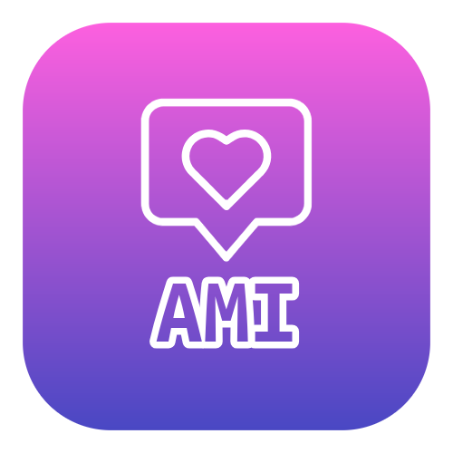

<p align="center">
  
</p>

# Amiga IA - Autonomous Agentic Suite & Declarative Skills

[English](README.md) | [Español](README.es.md)

[](https://www.npmjs.com/package/@anacatavc/amiga-ia)
[](https://deepmind.google/technologies/gemini/)
[](https://anthropic.com/)
[](https://openai.com/codex/)
[](LICENSE)

> 🎶 Repo name inspo: [Amiga Mia - Los Prisioneros](https://www.youtube.com/watch?v=qPHaLk4-_Ew)  
> 🌐 Product website: [amiga-ia.ana-catalina.com](https://amiga-ia.ana-catalina.com/)

---

### 1. Project Description
**Amiga IA** is a comprehensive ecosystem of *autonomous subagents*, *stateless guardrail hooks*, and *portable declarative skills* designed to elevate AI coding assistants from passive command executors into proactive team collaborators. Engineered for **Antigravity (Gemini)**, **Claude Code**, and **OpenAI Codex**, Amiga IA provides a single source of truth for scalable AI capability management built on the **Agent Skills (Markdown + Lazy Loading)** standard.

With **v3.0.0 ("The Agentic Evolution")**, Amiga IA introduces decentralized multi-skill orchestration, enabling specialized subagents to autonomously discover repository tools and conduct parallel code reviews, repository health audits, and automated documentation without requiring step-by-step human guidance.

### 2. Technologies & Architectural Innovations
* **Agent Skills (XML + Markdown Lazy Loading):** A token-efficient architecture where an index of available tools is compiled into the system prompt, allowing AI models to open and consume imperative skill instructions only when actively required.
* **Multi-Skill Parallel Orchestration (ADR-002):** Decentralized subagent profiles (such as `ami-pr-reviewer`, `ami-doc-architect`, and `ami-repo-auditor`) coordinate parallel worker threads to scan codebase technical debt, verify pre-push consistency, and review code concurrently.
* **Zero-Overhead Stateless Execution (ADR-003):** Background security hooks are optimized for token economy and zero memory pollution, operating seamlessly across native Bash, Windows PowerShell, and zero-dependency Node.js execution engines.
* **Compact System Prompt & Unified Hook Optimization (ADR-004):** Refactored Universal Adapter XML generation to use root-relative compact attributes and migrated inline PowerShell and Bash commands to external runtime scripts (`hooks/scripts/ami-hooks.ps1` & `ami-hooks.sh`). This achieved a verified **36.3% reduction (-1,211 tokens/turn)** in recurring System Prompt overhead (dropping from 3,335 to 2,124 tokens/turn), faster LLM inference, and zero hook deduplication errors.
* **Interactive CLI Wizard (`amiga-ia-setup`):** An automated setup, migration, and diagnostic suite built in Node.js that cleanly installs skills, merges configurations into AI user settings, and dynamically checks system health.

### 3. Key Learnings (Developer Takeaways)
Building and scaling Amiga IA through its evolution into a fully agentic ecosystem yielded significant engineering lessons:
* **Agentic vs. Passive Prompting:** Traditional step-by-step imperative scripts break down as codebases scale. Transitioning to autonomous subagent profiles that reason about project goals, discover local tools, and delegate worker threads in parallel proved dramatically more robust and scalable than monolithic prompt engineering.
* **Token Economy & Statelessness:** Early iterations utilized persistent background caching to store local session summaries. Iterative analysis revealed that retaining stale context across session restarts degraded LLM inference speed and inflated token consumption. Depreciating session state caching in favor of stateless, on-demand reactive inspections (ADR-003) drastically boosted system responsiveness and precision.
* **Mitigating the Silent Recurring Token Tax:** Dynamic tool catalogs injected into AI System Prompts impose a severe compounding cost over extended conversational sessions. Utilizing attribute-driven root-relative indexing instead of verbose XML wrapper hierarchies eradicated massive static redundancy (ADR-004). Furthermore, transitioning from complex inline shell expressions to standardized external runtime invocations prevented OS shell escaping gotchas and eliminated string-matching deduplication failures across platforms.
* **Cross-Platform & Multi-Engine Unification:** Achieving 100% cross-compatibility between disparate AI runtimes (Antigravity, Claude Code, and OpenAI Codex) and distinct operating systems (Linux/macOS Bash vs. Windows PowerShell) required abstracting hook logic into universal runtime scripts and enforcing strict capability translation across native formats.

### 4. Repository Structure
```text
amiga-ia/
├── package.json             # NPM Package registry definition & Single Source of Truth
├── agent/                   # Boilerplate Agent entrypoint (agent.js)
├── adapters/                # Universal XML catalog compiler (universal_adapter.js)
├── agents/                  # Autonomous Subagent profiles in Markdown (ami-*.md)
├── docs/                    # Persistent agent memory & documentation tree
│   ├── adr/                 # Architectural Decision Records (ADRs)
│   ├── architecture/        # Deep structural & adapter engineering guides
│   └── learning/            # Captured session learnings and iterative patterns
├── skills/                  # Canonical declarative Markdown skills (ami-*/SKILL.md)
├── codex/                   # Generated Codex-native skill and subagent files used by the installer
├── hooks/                   # Claude Code native and cross-platform guardrail hooks
│   ├── hooks.json           # Build copy of hooks.json (npm run build)
│   └── scripts/             # External runtime hooks (.js wrappers, ami-hooks.ps1, & ami-hooks.sh)
├── hooks.json               # Claude Code native hooks configuration (Bash engine)
└── hooks-pwsh.json          # Claude Code native hooks configuration (PowerShell engine)
```

### 5. Included Skills & Agents

All built-in capabilities strictly utilize the **`ami-`** namespace prefix to prevent collisions with external AI ecosystems.

| Type | Name | Description |
|---|---|---|
| Agent | **ami-cleanroom-builder** | Feature implementer for Cleanroom TDD. Writes production code strictly from formal interface contracts without overfitting to tests. |
| Agent | **ami-cleanroom-tester** | Independent black-box QA and test architect for Cleanroom TDD. Generates comprehensive tests solely from contracts, isolated from production code. |
| Agent | **ami-data-scientist** | Master orchestrator agent for Data & SQL. Coordinates exploratory dataset profiling, database query optimizations, and executive dashboards. |
| Agent | **ami-doc-architect** | Master documentation and knowledge orchestrator. Coordinates doc-manager, obsolescence audits, context research, and learnings extraction. |
| Agent | **ami-expert-council** | Spawns a council of specialized subagents tailored to discuss, debate, and refine a user's architectural idea from multiple perspectives. |
| Agent | **ami-pr-publisher** | Master orchestrator agent that performs a comprehensive review, summary drafting, and conflict audit on Pull Requests before publishing. |
| Agent | **ami-pr-reviewer** | Master orchestrator agent that evaluates existing Pull Requests via dual review modes (static Code Review vs dynamic Full Review with test execution), repository context ingestion, and adversarial verification trails. |
| Agent | **ami-push-assistant** | Pre-push orchestrator that conducts baseline quality, security leak scans, and data consistency checks before pushing code. |
| Agent | **ami-release-manager** | Central orchestrator agent that automates version tag calculation, bilingual semantic changelog drafting, and GitHub release publication. |
| Agent | **ami-repo-auditor** | Master audit orchestrator that evaluates codebase technical debt, dependency hygiene, and security across modules concurrently. |
| Agent | **ami-tech-lead** | Master Project Planning & Architecture Orchestrator. Evaluates repository health, plans features, and coordinates architectural design. |
| Skill | **ami-analyze-dependencies** | Audits project library health, detecting unused, outdated, vulnerable, or phantom dependencies. |
| Skill | **ami-analyze-pr-comments** | Analyzes code review observations left by teammates on active PRs, organizing action items and formulating accurate replies. |
| Skill | **ami-architect-project** | Interactively scaffolds project architectures, technology stacks, directory hierarchies, and bilingual starter documentation. |
| Skill | **ami-audit-quality** | Conducts deep inspections on modified code for maintainability, modular design best practices, security flaws, and structural soundness. |
| Skill | **ami-build-dashboard** | Builds interactive web dashboards and publication-quality Python visualizations from analytical datasets and KPIs. |
| Skill | **ami-create-tests** | Auto-triggered when new features lack automated test coverage. Crafts focused unit and regression tests tailored to modified code. |
| Skill | **ami-debug-issue** | Performs an evidence-based debugging procedure, isolating root causes without guesswork and writing regression tests. |
| Skill | **ami-design-test-strategy** | Designed to run before writing tests. Formulates QA test strategies, pyramid distributions, mocking boundaries, and CI quality gates. |
| Skill | **ami-detect-pr-conflicts** | Auto-triggered prior to PR publishing or review. Detects overlapping commit histories and potential merge conflicts across active branches. |
| Skill | **ami-draft-release** | Auto-triggered prior to publishing releases. Parses commit histories to draft structured bilingual release notes grouped by semantic type. |
| Skill | **ami-extract-learnings** | Inspects recent codebase edits to extract architectural decisions, lessons, antipatterns, and surprises into persistent memory. |
| Skill | **ami-guide-next-step** | Scans multi-dimensional project health, prioritizing tests, tech debt, code quality, and recommending optimal next steps. |
| Skill | **ami-manage-docs** | Comprehensive documentation and knowledge manager. Detects whether to architect new docs, synchronize wikis, or audit and prune obsolete learnings. |
| Skill | **ami-optimize-sql** | Writes and refactors SQL across major database dialects, eliminates query anti-patterns, and recommends high-impact indexes. |
| Skill | **ami-orchestrate-cleanroom** | Master Cleanroom (Double-Blind) TDD orchestrator. Interactively resolves interface doubts, freezes contracts, dispatches isolated implementer and test generator subagents, executes test harnesses, and adjudicates failures. |
| Skill | **ami-plan-commits** | Analyzes the working tree, performs security/leak audits, plans Conventional Commits/amend/squash, and executes staged git actions. |
| Skill | **ami-plan-feature** | Interactive feature planning and orchestration workflow. Clarifies ambiguities and proposes architectural alternatives with the user before investigating context and drafting plans. |
| Skill | **ami-profile-data** | Performs exploratory data analysis (EDA), quantifies null distributions, detects outliers, and audits methodological validity. |
| Skill | **ami-research-context** | Actively researches up-to-date external documentation and persists findings in references to prevent context degradation. |
| Skill | **ami-review-peer-pr** | Conducts code reviews on teammates' Pull Requests with PR body acceptance criteria traceability, dual review modes, and adversarial falsification audits ([Falsification Check]) to eliminate false positives. |
| Skill | **ami-review-self-pr** | Operates as a stringent Senior Engineer reviewing your own code with dual review modes, adversarial 5-dimension blind-spot probes ([Blind-Spot Probe]), and automated local test remediation loops. |
| Skill | **ami-scan-tech-debt** | Scans repositories for technical debt, obsolete imports, duplicated logic, dead code, and pending comments (TODOs/FIXMEs). |
| Skill | **ami-stress-test-idea** | Conducts adversarial stress-testing and premortem analysis on proposals, exposing SPOFs, concurrency bugs, and cost explosions. |
| Skill | **ami-tag-release** | Auto-triggered before release bumps. Evaluates git histories against semantic versioning laws to compute precise stable or QA tags. |
| Skill | **ami-validate-data** | Validates structural consistency between source code changes and data layer definitions (schemas, queries). |

### 6. Installation & Usage
The official and recommended setup method is installing Amiga IA globally via the NPM package registry:

```bash
npm install -g @anacatavc/amiga-ia
```

**Interactive Setup Wizard (CLI):**
Launch the setup wizard to choose your active AI coding environments (Antigravity, Claude Code, and/or OpenAI Codex) and configure supported hook runtimes:
```bash
amiga-ia-setup
```

**System Diagnostic & Health Tool (`doctor`):**
To verify global installation integrity, check for OS shell incompatibilities, validate YAML frontmatter schemas, and receive automated cleanup advisories for deprecated legacy folders:
```bash
amiga-ia-setup doctor
```

> 💡 **Background Hooks & Engine Selection:** Claude Code supports automated pre-commit advisory reminders and security interdictions. The interactive setup wizard cleanly merges these non-blocking guardrails into `~/.claude/settings.json` while generating an automated rollback backup at `~/.claude/settings.json.amiga-backup`. Google Antigravity natively executes its atomic planning pipeline and enforces declarative guardrails via `rules/ami-rules.md`. OpenAI Codex supports non-blocking lifecycle hooks in `~/.codex/hooks.json`.

#### 6.1 Global Directories Configured
When running `amiga-ia-setup`, the CLI wizard populates your home directory with clean, isolated capability configurations:

```text
~/.claude/                          # Claude Code Global Configuration
├── skills/ami-*/SKILL.md           # Declarative Skills (25 directories)
├── agents/ami-*.md                 # Autonomous Subagents (11 profiles)
├── settings.json                   # Merged Hooks (PreToolUse, PostToolUse)
└── settings.json.amiga-backup      # Safe original settings backup

~/.gemini/config/                   # Antigravity (Gemini) Global Configuration
├── skills/ami-*/SKILL.md           # Declarative Skills (25 directories)
├── agents/ami-*.md                 # Autonomous Subagents (11 profiles)
└── rules/ami-rules.md              # Declarative Operational Rules

~/.agents/skills/                   # Codex Global Skills (25 directories)
~/.codex/                           # Codex Global Configuration
├── agents/ami-*.toml               # Custom Subagents in TOML format (11 profiles)
└── hooks.json                      # Optional Lifecycle Hooks
```

### 7. Uninstallation
To cleanly detach Amiga IA from your AI coding environments:
1. Run `amiga-ia-setup` and select option `u` (Uninstall) to cleanly remove all copied skills, agents, rules, and hook injections from your settings.
2. Run `npm uninstall -g @anacatavc/amiga-ia` to purge the CLI package from your system.

### 8. Extending the Ecosystem
* **Mandatory Naming Convention (`ami-` prefix):** All custom skills and agent profiles MUST begin with `ami-` (e.g., `ami-db-migrator`). This ensures clean namespace separation and protects your custom tools from external conflicts.
* **Adding a New Skill:** Create a folder at `skills/ami-<name>/` containing a `SKILL.md` instruction file configured with standard YAML frontmatter.
* **Adding a New Agent:** Create an autonomous persona file at `agents/ami-<name>.md` detailing behavior rules, skill invocation authorizations, and coordination directives.

---


---

## License

This project is licensed under the MIT License. See [LICENSE](LICENSE) for details.

